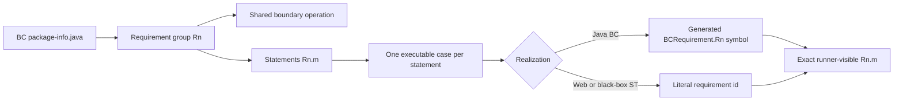
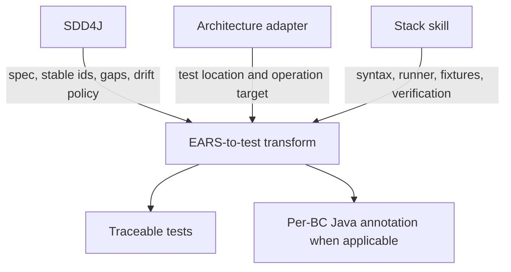

# SDD4J EARS Tests Skill

Transforms SDD4J EARS requirement statements into traceable parameterized, table-driven, or grouped tests. The mapping is stack-neutral: this skill owns the EARS-to-test-table transform and the spec-to-test trace, while composed architecture and stack skills determine the operation target, test location, syntax, fixtures, and verification command.

## When To Use

Use this skill when a capability spec, usually the `## Requirements` section of a BC's `package-info.java`, contains statements with ids such as `R1.1` and needs executable coverage with exact runner-visible traces. It also applies to acceptance criteria written with EARS patterns such as `When`, `If...then`, `While`, or `Where` that need parameterized or data-driven tests.

## Input And Output

Given a requirement group such as:

```md
### R1 Place an order

- R1.1 - When a cart with at least one item is submitted, the capability shall create and confirm an order.
- R1.2 - If the cart is empty, then the capability shall reject the request.
```

the skill produces:

- one shared test skeleton for group `R1` when its statements share an operation;
- one case or row for each statement, `R1.1` and `R1.2`;
- the exact statement id as the runner-visible case name;
- an EARS role and corresponding arrange, act, and assert shape for each row;
- bidirectional checks between requirement ids in the spec and traces in tests.

The transform does not invent missing ids, fixtures, domain values, error contracts, or assertions. When the available spec and code do not determine those details, generation leaves an explicit failing TODO, disabled placeholder with a reason, or another stack-idiomatic red test.

## Transform



## EARS Case Shapes

| Pattern | Arrange | Act | Assert | Role |
| --- | --- | --- | --- | --- |
| `When <trigger>...` | default state | trigger | response | happy |
| `If <trigger>, then...` | default state | invalid trigger | rejection or error | unhappy |
| `While <precondition>...` | precondition | implicit | response | stateful |
| `While <precondition>, when <trigger>...` | precondition | trigger | response | full tuple |
| `Where <feature is included>...` | feature enabled | trigger or implicit | response | gated |
| `The capability shall...` | default or global state | implicit | invariant | invariant |

Happy and unhappy rows may share one parameterized test when they exercise the same operation skeleton.

## Java Requirement Annotation

Java stacks generate one public annotation per BC in its root package, beside packages such as `boundary/`, `control/`, and `entity/`:

```text
{BC name in CamelCase}Requirement.java
```

For a BC named `checkout`, the generated type is `checkout.CheckoutRequirement`. It is `@Documented`, targets methods, has runtime retention, and contains a nested `Rn` enum with one constant per statement in the spec:

```java
package checkout;

import java.lang.annotation.Documented;
import java.lang.annotation.ElementType;
import java.lang.annotation.Retention;
import java.lang.annotation.RetentionPolicy;
import java.lang.annotation.Target;

@Documented
@Target(ElementType.METHOD)
@Retention(RetentionPolicy.RUNTIME)
public @interface CheckoutRequirement {

    enum Rn {
        R1_1("R1.1", "When a cart with at least one item is submitted, the BC shall create and confirm an order."),
        R1_2("R1.2", "If the cart is empty, then the BC shall reject the request.");

        private final String id;
        private final String statement;

        Rn(String id, String statement) {
            this.id = id;
            this.statement = statement;
        }

        public String statement() {
            return statement;
        }

        @Override
        public String toString() {
            return id;
        }
    }

    Rn[] value();
}
```

The BC name prefixes the annotation because requirement ids are local to a capability and annotation elements require a concrete enum type. Types such as `CheckoutRequirement.Rn.R1_1` and `PaymentRequirement.Rn.R1_1` therefore remain unambiguous without requiring fully qualified annotation names in code that references multiple BCs.

The annotation is generated wholesale from the BC spec on every `/sdd4j apply` pass and must not be hand-edited. The EARS sentence is emitted as documentation and as the runtime `statement()` value. `toString()` returns only the literal id so runners display `R1.1`, not its normalized Java symbol `R1_1`.

## Java Usage

Use the annotation on a boundary method to declare all requirement statements it realizes:

```java
import checkout.CheckoutRequirement;

import static checkout.CheckoutRequirement.Rn.*;

@CheckoutRequirement({R1_1, R1_2})
public Order placeOrder(Cart cart) {
    // boundary implementation
}
```

Use the enum constant as the per-row trace in a JUnit 5 parameterized test:

```java
import checkout.CheckoutRequirement;

import static checkout.CheckoutRequirement.Rn.*;

@ParameterizedTest(name = "{0}")
@MethodSource("placeOrderCases")
void placeOrder(CheckoutRequirement.Rn requirement, Cart cart, boolean shouldConfirm) {
    var outcome = checkout.placeOrder(cart);
    assertEquals(
        shouldConfirm,
        outcome.isConfirmed(),
        requirement + " - " + requirement.statement()
    );
}

static Stream<Arguments> placeOrderCases() {
    return Stream.of(
        arguments(R1_1, Cart.of(item("duke-sticker")), true),
        arguments(R1_2, Cart.empty(), false)
    );
}
```

Do not repeat the group's statement list as an annotation on a parameterized test method; the rows already provide the per-statement trace and duplicating that list creates drift. For a single-statement group, a plain test may use `@CheckoutRequirement(R1_2)`.

Zero-dependency Java tests use the same `Rn` constants in their case records or lists. Web stacks and black-box `-st` modules use literal string ids because they do not depend on the server's generated Java types.

## Trace And Drift

- Every `Rn.m` in the spec must resolve to at least one runner-visible test trace.
- Every literal or symbolic test trace must resolve to an existing statement in the owning BC's spec.
- Symbolic ids such as `R1_2` are compared through their display form, such as `R1.2`.
- JavaDoc and comments alone are not executable traces.
- Removing a requirement removes its generated enum constant, so stale Java rows fail compilation.
- Adding a requirement creates an unused constant, which the bidirectional trace coverage pass must detect.
- A statement may have multiple tests only when they intentionally cover distinct levels or scenarios.
- Cross-capability ids belong in one test only when the project explicitly defines cross-capability system tests.
- Orphan test ids are reported as drift; the spec is never edited merely to absorb them.

## Composition



## Source Contract

See [`SKILL.md`](SKILL.md) for the executable instructions and [`references/realizations.md`](references/realizations.md) for JUnit 5, zero-dependency Java, and cross-capability system-test examples.
