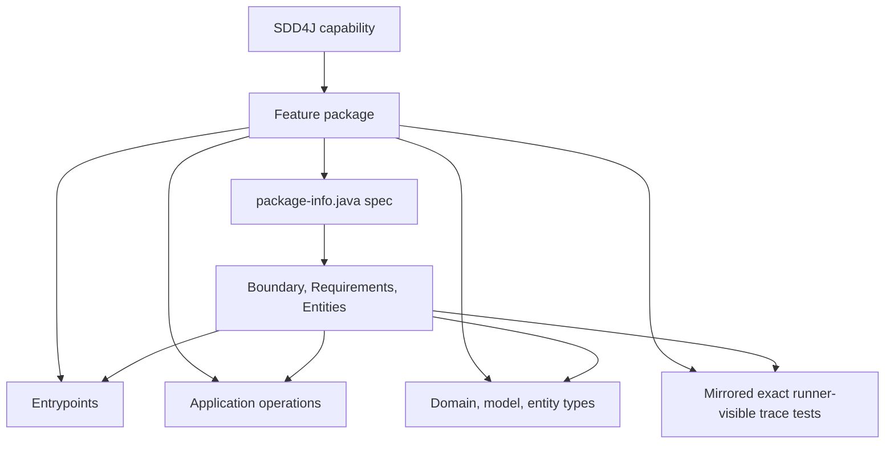

# SDD4J Package By Feature Skill

Maps an SDD4J Java capability to one feature-owned package.

## When To Use

Use this architecture adapter when each feature or capability owns a package containing its spec, entrypoints, application code, domain/model code, and tests.

Compose it with `sdd4j` for the spec workflow and a Java stack skill for framework conventions and verification. Use a different adapter when code is primarily organized by global technical layers or strict BCE components.

## Mapping



## Default Layout

```text
src/main/java/<base>/<capability>/
  package-info.java
  web/
  application/
  domain/
  persistence/

src/test/java/<base>/<capability>/
```

## Core Rules

- One SDD4J capability maps to one Java feature package.
- The feature package is the default ownership boundary.
- The spec lives in the feature package's `package-info.java`.
- Contract-relevant code belongs in or below the feature package unless `AGENTS.md` declares an exception.
- Shared packages are exceptional and must be declared or treated as cross-cutting implementation.
- Boundary operations map to the narrowest stable entrypoint or application operation inside the feature package.
- Requirement ids must resolve to exact runner-visible test identities through literal ids or resolvable symbols; JavaDoc and comments alone do not count.
- Public capability operations, contract-relevant entity types, traces, or capability code outside the declared package mapping are reported as inverse drift.
- Do not mix feature-package, layered, and BCE adapters inside one capability.

## Source Contract

See [`SKILL.md`](SKILL.md) for the executable skill instructions.
