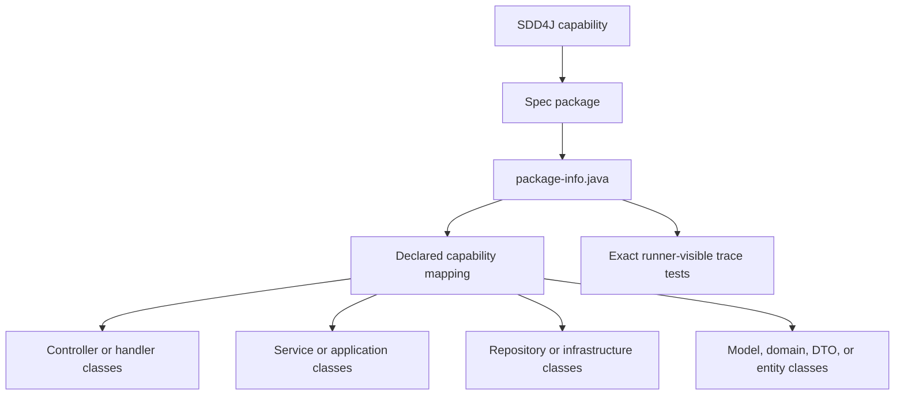
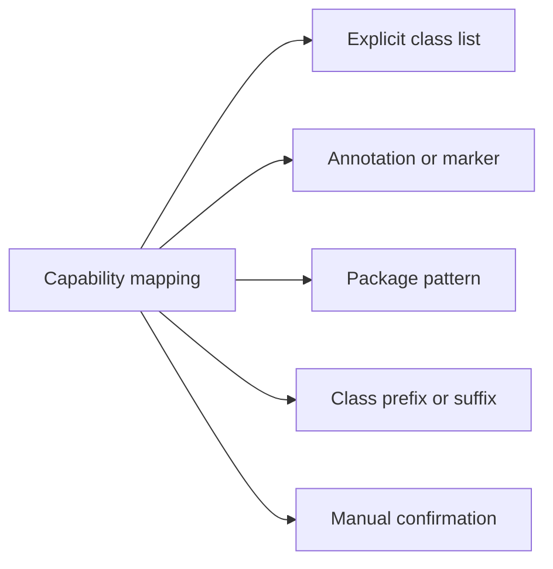

# SDD4J Package By Layer Skill

Maps an SDD4J capability spec to Java classes spread across technical layer packages.

## When To Use

Use this architecture adapter for existing layered Java applications where controllers, services, repositories, models, DTOs, and infrastructure are intentionally separated by technical package.

Compose it with `sdd4j` for the spec workflow and a Java stack skill for framework conventions and verification. The project must declare a stable capability-to-class mapping; class-name guessing is only a setup aid.

## Mapping

## Mapping Strategies

## Core Rules

- One capability maps to one spec package plus one declared set of layer classes.
- The spec package is the capability identity even when implementation code lives elsewhere.
- A class belongs to a capability only when the configured mapping says it does.
- Prefer explicit `AGENTS.md` mapping; do not rely on class-name guessing as a stable operating mode.
- Report ambiguous mapping as uncertainty instead of editing code or specs speculatively.
- Treat shared models and infrastructure as declared shared code, explicit capability mappings, or exclusions from capability drift checks.
- Requirement ids must resolve to exact runner-visible test identities through literal ids or resolvable symbols; JavaDoc and comments alone do not count.
- Report mapped operations, entity types, and test traces without spec counterparts as inverse drift.
- Do not mix layered, feature-package, and BCE adapters inside one capability.

## Source Contract

See [`SKILL.md`](SKILL.md) for the executable skill instructions.
