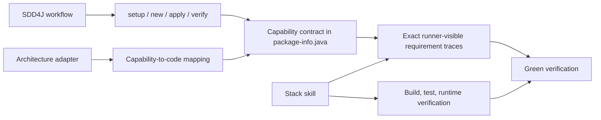
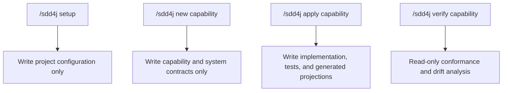

# SDD4J Skill

Drives Spec-Driven Development for Java using `package-info.java` as the co-located capability contract.

## Inspiration

SDD4J was inspired by [SBCE](https://sbce.space/), created by Adam Bien.

In particular, SDD4J builds on SBCE's use of co-located `package-info.java` capability contracts, EARS requirements, executable traceability, and spec-to-code convergence. While SBCE deliberately applies these ideas to Boundary-Control-Entity components, SDD4J separates the workflow from architecture and stack concerns through composable adapters, allowing the same approach to be used with BCE and non-BCE layouts and with stacks such as Spring Boot.

## When To Use

Use this skill for SDD4J setup, new capability specs, applying specs to code, verifying code against specs, EARS requirements, and traceable Java tests.

## Composition

SDD4J owns the workflow and contract format. Compose it with one primary architecture adapter for capability-to-code mapping and one Java stack skill for implementation conventions and verification. Explicitly declare routing in `AGENTS.md` when modules or package roots use different adapters.

## Modes

`new` may create the capability package as part of writing its `package-info.java`, but it does not create implementation classes, entities, tests, or stack-specific scaffolding. Those changes belong to `apply`.

## Spec Contract

An SDD4J capability spec defines:

- `## Boundary` transport-neutral operations.
- `## Requirements` EARS statements with stable ids such as `R1.1`.
- Optional `## Entities` names for stateful domain concepts owned by the capability.
- Optional confirmed capability-local decisions with stable `Dn` ids.
- A required `## Out of scope` boundary, which may be empty.
- Optional `AGENTS.md` spec language for localized EARS prose.

The executable skill retains the normative section-order, EARS, traceability, and drift rules used by `new`, `apply`, and `verify`.

## Templates

- [`references/capability-spec-template.md`](references/capability-spec-template.md) authors a capability contract in `package-info.java`.
- [`references/system-doc-template.md`](references/system-doc-template.md) authors the optional cross-capability system contract.
- [`references/readme-template.md`](references/readme-template.md) authors the optional repository README projection.

## System Documentation

Cross-capability concerns may live one package above the capability specs at `src/main/java/<base>/package-info.java`. The optional system doc can declare the charter, vision, component wiring, tested `Sn` system invariants, ubiquitous language, confirmed `Dn` decisions, and composed stack without duplicating capability contracts.

An optional repo-root README can project the system charter, vision, capability map, and declared component wiring inside `sdd4j:generated` markers. Content outside the markers remains hand-maintained; without markers, `apply` leaves the README untouched.

## Core Rules

- The spec is the source of truth for intended behavior.
- One capability has one spec.
- Every requirement id must resolve to the exact runner-visible identity of at least one executable test or case associated with the capability.
- A trace may use the literal id or a symbol whose display form is the literal id.
- Traceability is complete in both directions: every requirement has a test trace, and every literal or symbolic trace resolves to an existing requirement.
- JavaDoc and comments alone do not count as traceability.
- `new`, `apply`, and `verify` resolve `Spec language` from `AGENTS.md ## SDD4J`; when absent, specs are written and checked in English.
- EARS patterns are semantic and may be localized when configured.
- English requirements use `shall`; localized requirements use a consistent mandatory equivalent in the configured language.
- `apply` writes the correct implementation to pass new traceable tests.
- Code-to-spec drift is reported, not silently absorbed into the spec.
- Done means stack verification is green, no structural gap or drift remains, and traced tests and implementation semantically conform to every requirement.

## Source Contract

See [`SKILL.md`](SKILL.md) for the executable skill instructions.
