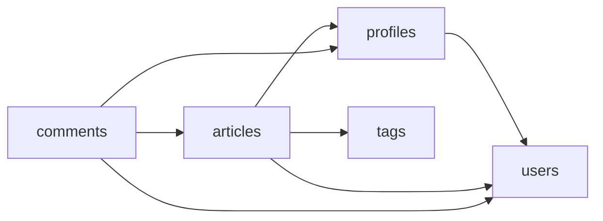

# RealWorld — Scala 3 · Typelevel · Spec-Driven

<!-- sdd4j:generated:start — projection of the specs; do not edit; regenerate from the system doc + per-capability package docs -->

> Serve the RealWorld API contract: a social blogging backend where readers become authors, follow one
> another, and curate what they read by tag.

**Vision:** Make the specification, not the code, the thing you edit first — and let the build tell you
the moment the two disagree.

## Capabilities

| Capability | Responsibility | Spec |
| --- | --- | --- |
| **users** | Own account identity: registration, credential authentication, token issuance, and the account view that only its owner may read. | [`package.scala`](src/main/scala/realworld/users/package.scala) |
| **profiles** | Publish the public face of an account and own who follows whom. | [`package.scala`](src/main/scala/realworld/profiles/package.scala) |
| **articles** | Own authored posts: publishing them under a stable slug, browsing and filtering them, and recording who favorited what. | [`package.scala`](src/main/scala/realworld/articles/package.scala) |
| **comments** | Own the replies attached to an article and who may withdraw them. | [`package.scala`](src/main/scala/realworld/comments/package.scala) |
| **tags** | Own the set of tags in use across the system, so readers can discover what is being written about. | [`package.scala`](src/main/scala/realworld/tags/package.scala) |

## Components



<!-- sdd4j:generated:end -->

## The idea

This repository is an experiment in **Spec-Driven Development**, applied to a problem with a real,
externally-defined contract: the [RealWorld](https://docs.realworld.show/introduction/) backend API.

The specification is not documentation *about* the code. It is a `package.scala` file sitting in the same
directory as the code it governs, holding EARS requirement statements with stable ids, and every one of
those ids is carried by a test name. Nothing enforces that by convention — `SpecTraceSuite` enforces it by
failing the build:

```
spec trace coverage (118 ids claimed by tests)
  system       3/3       traced
  articles     48/48     traced
  comments     14/14     traced
  profiles     16/16     traced
  tags         5/5       traced
  users        32/32     traced
```

Add a requirement to a spec and the build goes red until a test carries its id. Write a test claiming an id
no spec declares and the build goes red too, and reports it as drift rather than quietly widening the spec
to match. That second direction is the one that matters: it is what stops the specification from becoming
a story told after the fact.

The background reading that started this — an analysis of Nicolas Duminil's foojay article on living
specifications, and how its Java-shaped ideas carry over to Scala — is in
[`docs/sdd-background.md`](docs/sdd-background.md).

## Status

All five capabilities are applied end to end over http4s with in-memory storage: accounts and tokens,
public profiles and the follow graph, the tag registry, the whole article surface — publishing, browsing
with filters and pagination, the feed, updates, deletion and favorites — and comments.

The [official RealWorld Hurl suite](https://github.com/realworld-apps/realworld/tree/main/specs/api) is the
project-level definition of done, and it passes:

```
Executed files:    13
Executed requests: 154
Succeeded files:   13 (100.0%)
Failed files:      0 (0.0%)
```

`scripts/api-conformance.sh` fetches and runs it against a locally running server. It needs `hurl` on the
path (`brew install hurl`) and a server started with `sbt run`.

## How a capability gets built

```
/sdd4j new <capability>       author or extend the spec in <capability>/package.scala
/sdd4j apply <capability>     converge code and traced tests onto it
/sdd4j verify <capability>    read-only conformance and drift report
```

`AGENTS.md` holds the project configuration: the SDD4J settings, and the mapping that makes the Java-shaped
`sdd4j-bce` adapter work in Scala. Read it before touching a component.

## Conventions

These are project-local standards. They are *declared, not verified* — no requirement id, no test.

- The spec is the contract. Never widen one to bless code that already exists; report it as drift.
- A capability spec file holds the scaladoc and the `package` clause, nothing else.
- Requirement ids are unique per capability, not globally: `users` R1.1 and `tags` R1.1 are different
  statements, and a trace only counts inside its own capability's tests.
- `control` and `entity` stay polymorphic in `F[_]`. `IO` appears only in `Main` and in tests.
- Domain errors travel in a Cats MTL typed channel; `boundary` is the only layer that knows an HTTP status.
- Every side effect is suspended. No `Instant.now()` or `UUID.randomUUID()` outside `Clock`/`Random`/`Sync`.
- Where the RealWorld prose documentation and the Hurl suite disagree, the suite wins (decision D9).

## Build and run

```bash
sbt test           # verification command — includes the SpecTraceSuite drift gate
sbt run            # http://localhost:8080
sbt scalafmtAll    # format
```

Configuration is read from the environment, all of it optional:

| Variable | Default |
| --- | --- |
| `REALWORLD_HOST` | `0.0.0.0` |
| `REALWORLD_PORT` | `8080` |
| `REALWORLD_JWT_SECRET` | a development placeholder — set this for anything real |
| `REALWORLD_TOKEN_TTL_MINUTES` | `1440` |
| `REALWORLD_BCRYPT_LOG_ROUNDS` | `10` |

## Storage

Mid-swap, by design. `tags`, `users` and `profiles` keep their state in PostgreSQL (decision D11);
`articles` and `comments` are still `Ref`-backed (decision D3). So a restart forgets the articles and
remembers the accounts and who follows whom.

```bash
docker compose up -d    # the database sbt run expects
sbt run
```

`sbt test` does not use that database — it starts its own through Testcontainers, which needs only a
running Docker engine. If discovery fails with *client version 1.32 is too old*, that is Testcontainers'
default API version rather than anything local; `TestDatabase` pins a newer one.

Tests no longer run suites in parallel. A database-backed fixture resets a shared schema, and two suites
doing that at once would see each other's tables disappear. The cost is tracked in
[`docs/postgres-swap.md`](docs/postgres-swap.md).

## What's next

Decision D3 chose in-memory storage so it could be swapped later. The second experiment tests whether
the specifications were describing behaviour or describing the implementation: a correct swap to
Postgres should touch zero requirement statements and leave all 118 traces intact.

[`docs/postgres-swap.md`](docs/postgres-swap.md) is the pre-registration — the swap surface, the
hazards found by reading the code, and the three outcomes fixed in advance so the result cannot be
decided after the fact.

```bash
scripts/spec-baseline.sh    # 118 requirement statements, unchanged since the baseline
```

`SpecTraceSuite` guards the set of requirement ids. This guards their wording, which is the part a
storage swap would be tempted to adjust.
